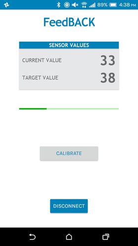
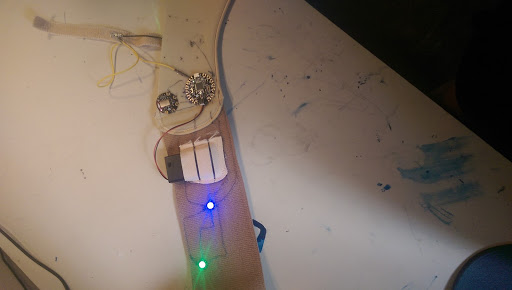

# bluetooth-back-sensor
Bluetooth enabled spinal position monitoring and posture correction device

This project was originally made for my grade 11 Health Science class in 2016

Uses a stretch sensor to measure the distance between two points on the spine and reports how far off it is from a user set optimal position using onboard RGB LED and bluetooth connection to a smartphone app.

[Link to slideshow used for school](https://docs.google.com/presentation/d/1BUM9tQXJSWAe9sjB-eK0dO6JpRo8mt2f_Prkby7zd6o/edit?usp=sharing)
